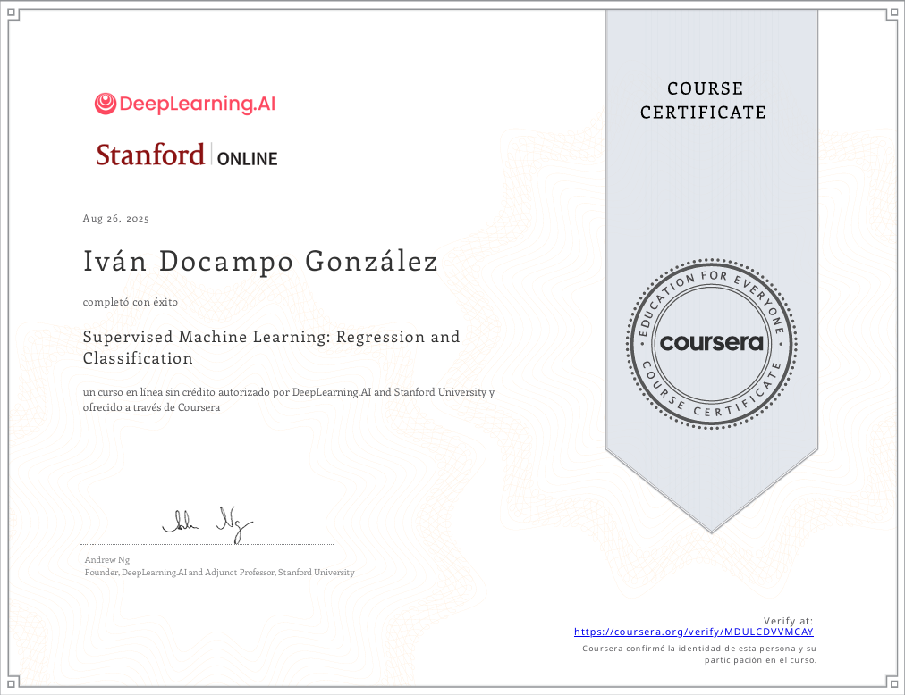
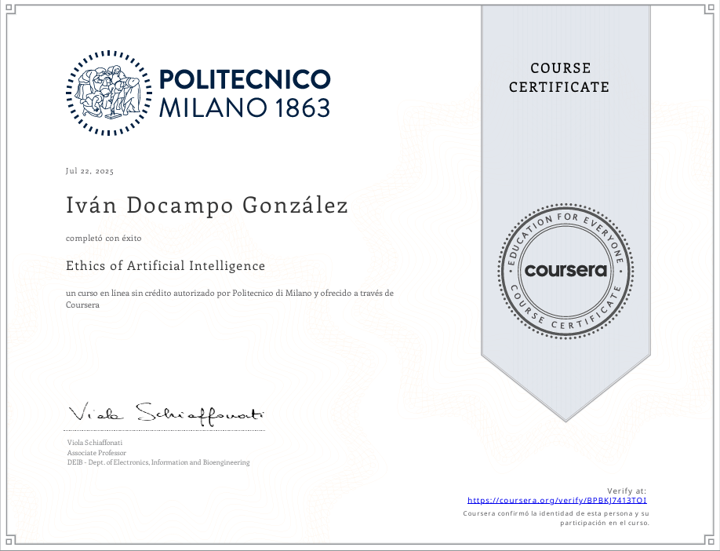

 
 

&nbsp;

&nbsp;

---

**Languages**

**ML / DL**

**Data & Scientific**

**Tools**

---

 

International COIL Project (Collaborative Online International Learning) carried out between Seneca Polytechnic (Canada) and Universidade da Coruña (Spain).

Active participation as a developer in an international agile team, applying principles of collaborative software engineering. Implementation of SCRUM methodologies, multidisciplinary communication, technical problem-solving, and continuous delivery of functional components.

The project focused on developing a digital solution simulating a professional environment, with clearly defined roles and real deliverables.

---

<table border="0" cellspacing="10" cellpadding="0">
<tr>
<td align="center">

</td>
<td align="center">

</td>
</tr>
</table>

---

&nbsp;

&nbsp;

  

