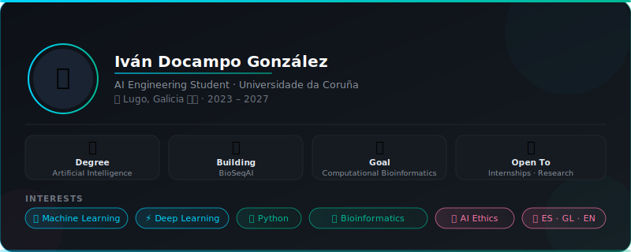
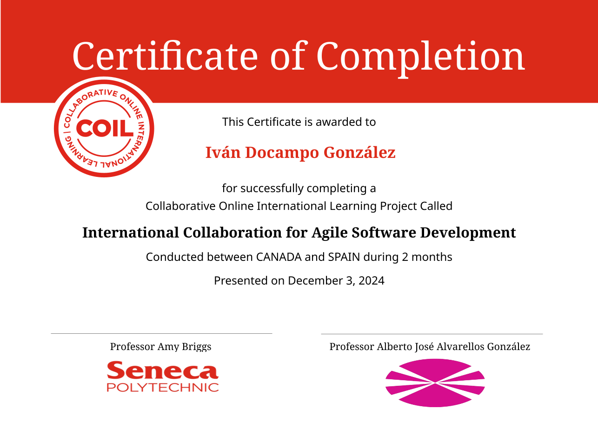

  

---

---

**Languages & Core**

**ML / DL**

**Data & Scientific**

**Tools**

---

| Institution | Certification |
|---|---|
| Stanford / DeepLearning.AI | Supervised Machine Learning: Regression & Classification |
| Politecnico di Milano | Ethics of Artificial Intelligence |
| Amazon Web Services | AWS Services for AI Solutions |
| University of Michigan | Python for Everybody |
| Lewrick & Company | AI and Innovation Compact |
| Kaggle | Data Analysis with Pandas |
| Google | Use AI Responsibly |
| Google | Introduction to Responsible AI |
| Microsoft | Responsible AI with GitHub Copilot |
| Microsoft | Introduction to Building with Power BI |
| Microsoft | Principles of Sustainable Software Engineering |
| NVIDIA | Building a Brain in 10 Minutes |
| NVIDIA | Introduction to Networking |
| Seneca Polytechnic | International Collaboration for Agile Software Development |

---

 

International COIL Project (Collaborative Online International Learning) carried out between Seneca Polytechnic (Canada) and Universidade da Coruña (Spain).

Active participation as a developer in an international agile team, applying principles of collaborative software engineering. Implementation of SCRUM methodologies, multidisciplinary communication, technical problem-solving, and continuous delivery of functional components.

The project focused on developing a digital solution simulating a professional environment, with clearly defined roles and real deliverables.

---

 

 

---

  

&nbsp;

&nbsp;

